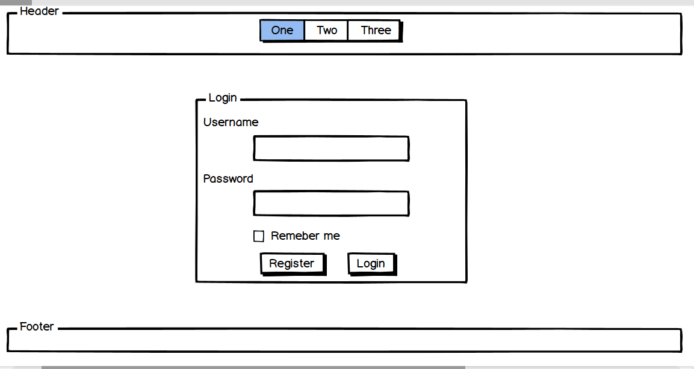

# Tech Book Lounge

## Project Description
It is the first  E-library for technical and computer science books in the Middle East. It allows users to find many books in one location. We aim to make books easier to find and provide a simple and enjoyable experience for the user. Someday, we will be the biggest E-library.

## Requirements
Build a web app using Express.
Use Mongo DB as a backend.
Styling web pages using Bootstrap.
Use Trello for group tasks management.
Use Github for group coding.
Wireframes.
ERD for DB.
Authentication: sign in, sign up, sign out and change password.
Admin can add, delete and edit books.
User can viewbooks, add the book to favorite list or finish reading list.

## Wireframes
Omega E-library includes 9 pages: landing, sign up, sign in, books, book details, favorite books list, finished read list, add books and about us.
### sign in

### sign up

### Landing Page

### Books Page

### Books Details

### Favorite List Page

### Finished Reading List Page

## Design Database Models (ERD)

## Difficulties in the Project
- Working with array in MongoDB
- Working with different developer levels

## Favorite part of the Project
- Using Bootstrap for designing
- Working as back-end developer.

## Upgrade in the Future
- Rate and review 
- Search for book

## link to Tech Book Lounge
https://etechlibrarysa.herokuapp.com/
